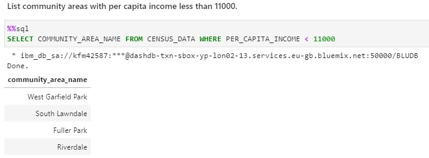
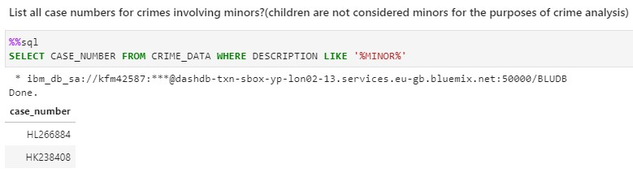
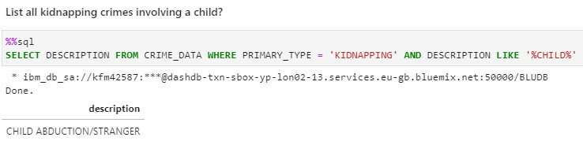
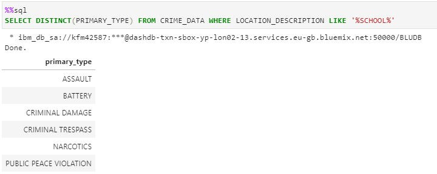
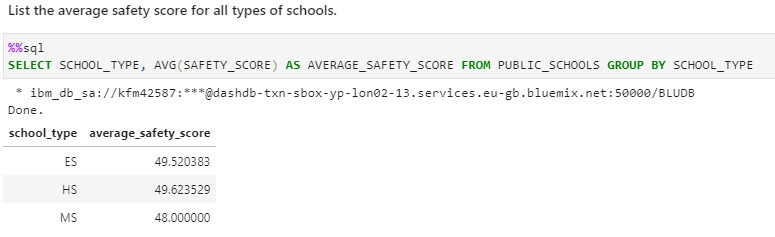
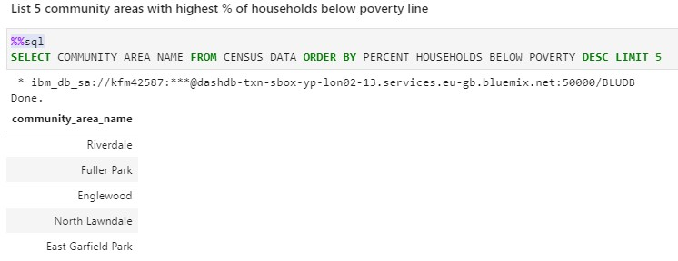
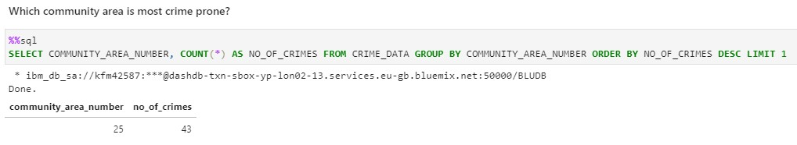
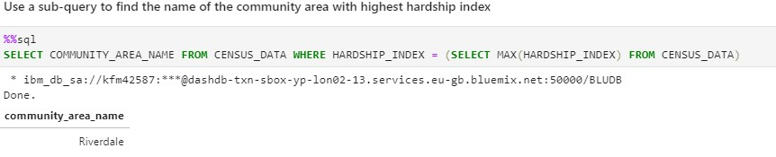
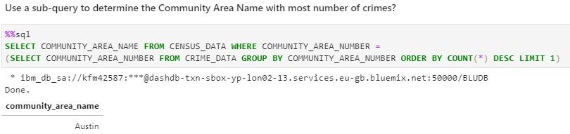

# Chicago Census, Crime, and School Data Analysis using SQL

## Context

Using a a real world dataset provided by the Chicago Data Portal, assume the role of a data analyst hired by a non-profit organization that strives to improve educational outcomes for children and youth in the City of Chicago. 
The job is to analyze the census, crime, and school data for a given neighborhood or district, identifying causes that impact the enrollment, safety, health, and environment ratings of schools.

Using SQL queries, anwer a number of questions about the dataset.

In this assignment:
- Download the datasets provided
- Load them into a database
- Write and execute SQL queries to answer the problems provided
- Upload screenshots showing the correct SQL queries and results for peer review. 

## Problems

The full notebook can be found [here]. It follows the assignment instructions outlined above, and answers the following problems. Screenshots to the problems are also shown below. 

**Problem 1**: Find the total number of crimes recorded in the CRIME table.

  

**Problem 2**: List community areas with per capita income less than 11000.

  

**Problem 3**: List all case numbers for crimes involving minors?

  

**Problem 4**: List all kidnapping crimes involving a child?(children are not considered minors for the purposes of crime analysis)

  

**Problem 5**: What kind of crimes were recorded at schools?

  

**Problem 6**: List the average safety score for all types of schools.

  

**Problem 7**: List 5 community areas with highest % of households below poverty line.

  

**Problem 8**: Which community area(number) is most crime prone?

  

**Problem 9**: Use a sub-query to find the name of the community area with highest hardship index.

  

**Problem 10**: Use a sub-query to determine the Community Area Name with most number of crimes.

  

